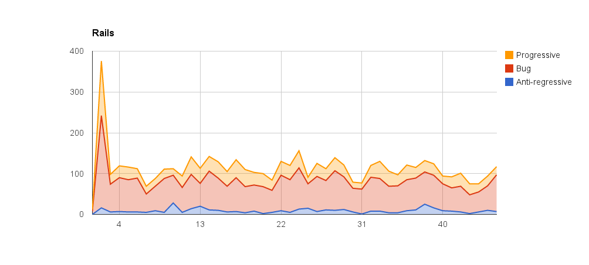
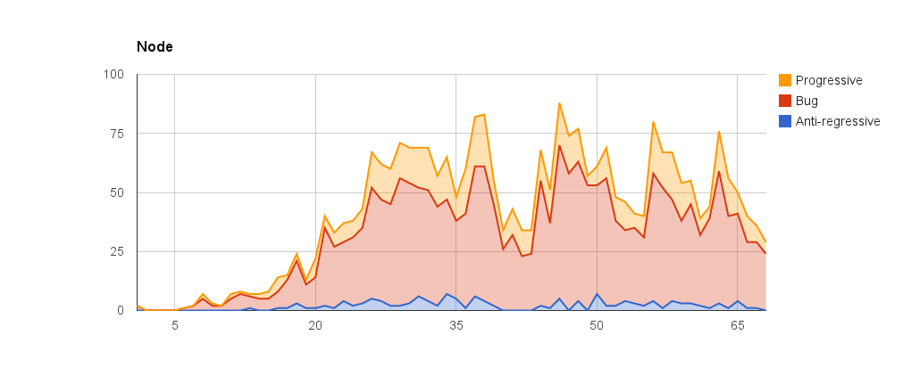
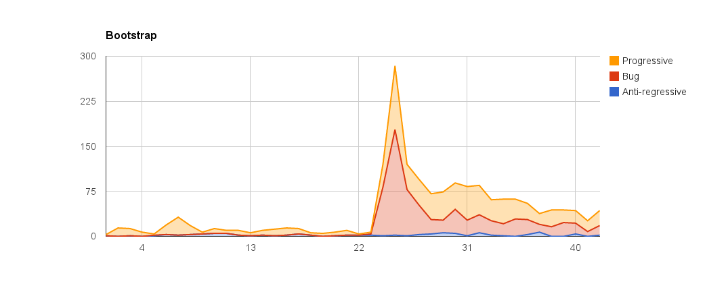
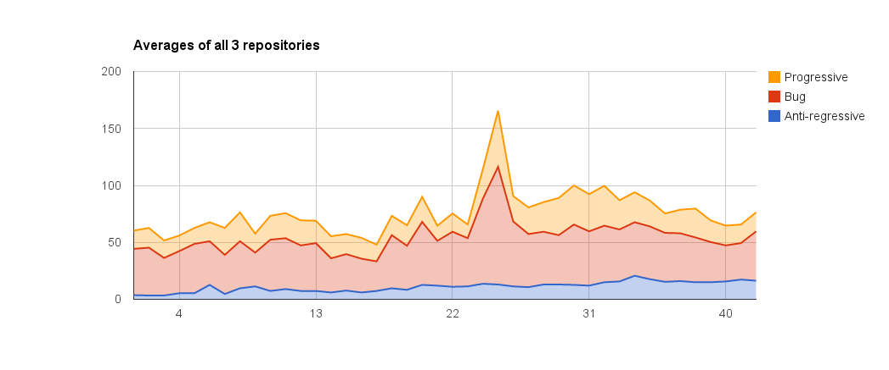

# SENG371-Devin-and-Andrew

##Our Project Question: 
How does the number of progressive (new feature) and anti-regressive (maintenance) changes over time affect the number of bugs discovered?
This is useful for showing the usefulness (or not) of anti-regressive changes such as refactoring code, and if too many new features are causing unreasonable spikes in bugs.

##Methodology: 
We will gather data to create graphs of progressive changes, anti-regressive changes and the number of reported bugs. The data on bugs, anti-regressive and progressive changes will be taken by performing searches in the GitHub issue tracker, which can be searched using "bug created:2012-11-01..2012-12-01" to specify the dates of tickets created with the word bug in them, or "label:bug created:2012-11-01..2012-12-01" if that project uses a label to represent bugs. We have created a python script that hits GitHub's API in monthly increments to search the number of issues or pull requests with certain queries and/or labels. To use it, you can clone this repository, navigate to the cloned folder, and type in the command as shown in the Python Script Usage section below. The script will print out the number of found issues as it receives them, about every 3 seconds (to keep within github's rate limit), and once it reaches the end date, will print out the total, and the month number/number of found issues in csv format.

##Python Script Usage:
bugCounter.py -u (githubUsername) -p (githubPassword) -a (startYear) -b (startMonth) -c (endYear) -d (endMonth) -o (owner) -r (repository) -q (query) -l (label)

* The -l and -q arguments for adding a label and a query is optional

** Username and password are used to improve the GitHub API's rate limit from 5 requests per minute to 20 requests per minute. USE AT YOUR OWN RISK!

** If searching with multiple words in the query, make sure to surrond them in quotes to pick up the whole string (eg. -q 'refactor OR rewrite')

##Codebases/Systems: 
Ruby on Rails (6674 issues - GitHub issue tracker): https://github.com/rails/rails

node.js (5608 issues - GitHub issue tracker): https://github.com/joyent/node 

Bootstrap (10,820 issues - GitHub issue tracker): https://github.com/twbs/bootstrap

##Metrics
The metrics we used are the number of issues with reference progressive, anti-regressive changes, and those with reference to bugs. This was done slightly differently in different repositories, as shown below:
####Rails - searched between April 2011 to Feb 2015
Since rails didn't have useful labels on their issues, we used keyword searches. For anti-regressive changes, we searched for "rewrite", for progressive changes we searched for "feature", and for bugs we searched for "bug". 			
####Node - searched between June 2009 to Feb 2015
Since node also didn't have useful labels on their issues, we used keyword searches. For anti-regressive changes, we searched for "rewrite", for progressive changes we searched for "feature", and for bugs we searched for "bug". 
####Bootstrap - searched between August 2011 to Feb 2015
Bootstrap has a few labels that match up well with our metrics, so we used the label "feature" for progressice changes, the label "confirmed" for bugs (this represented a confirmed bug), and since there weren't any labels for anti-regressive changes, we used the keyword search of "rewrite", similar to the other repositories.		 

##Results:
The csv data returned from the script was imported to a google sheets file, which was then used to create the following graphs:

The data was then trimmed to match the shortest range of data (from the Bootstrap repo), and averaged to give us an overall view:
	
	
##Analysis
	an answer to your original question based on these data sources and your methodology
	threats to validity
	future work
##Project Management Information
	milestones and timelines
	roles of team members

##Milestones: 
1. Done by Feb 4th - Gather data on number of reported bugs per month for each codebase.
2. Done by Feb 11th - Gather data on number of progressive and anti-regressive changes each month.
3. Done by Feb 18th - Use data to create graphs or similar visual ways to represent the data.
4. Done by Feb 23rd - Draw conclusions.

